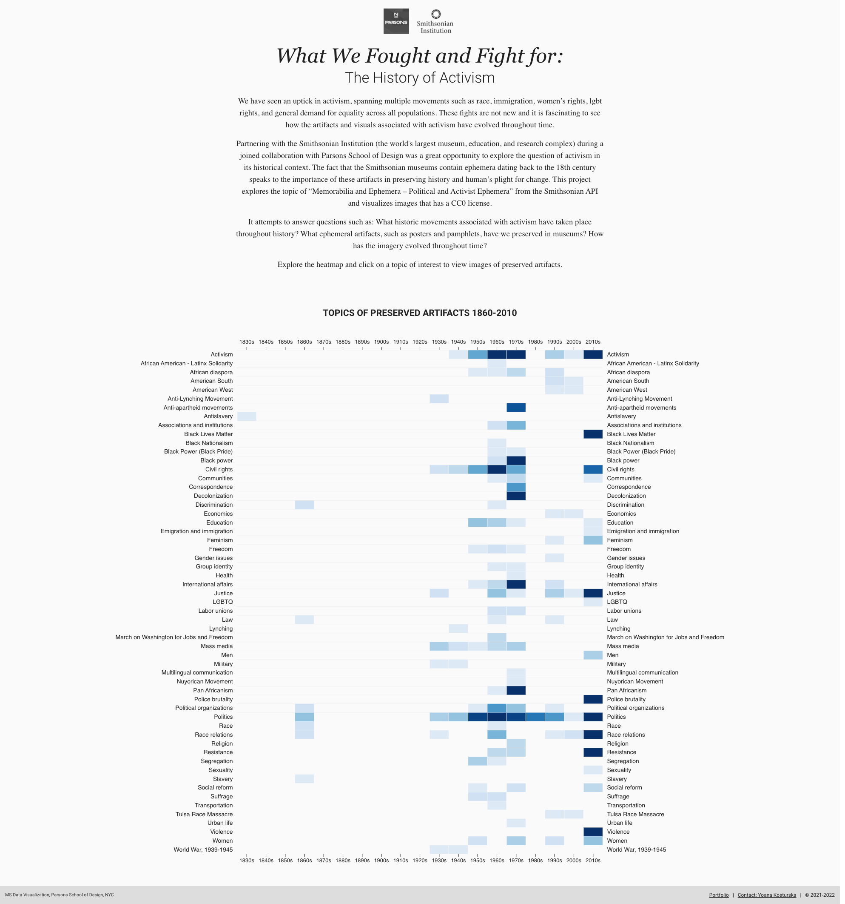
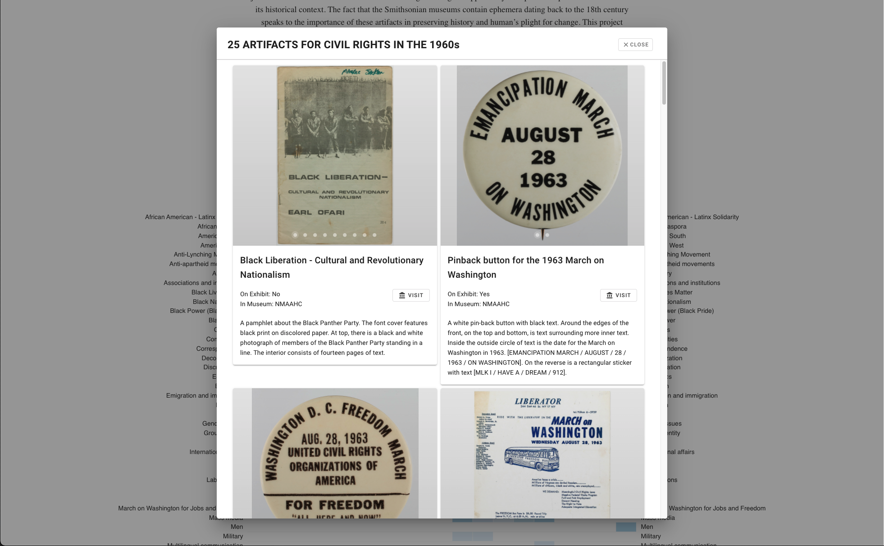
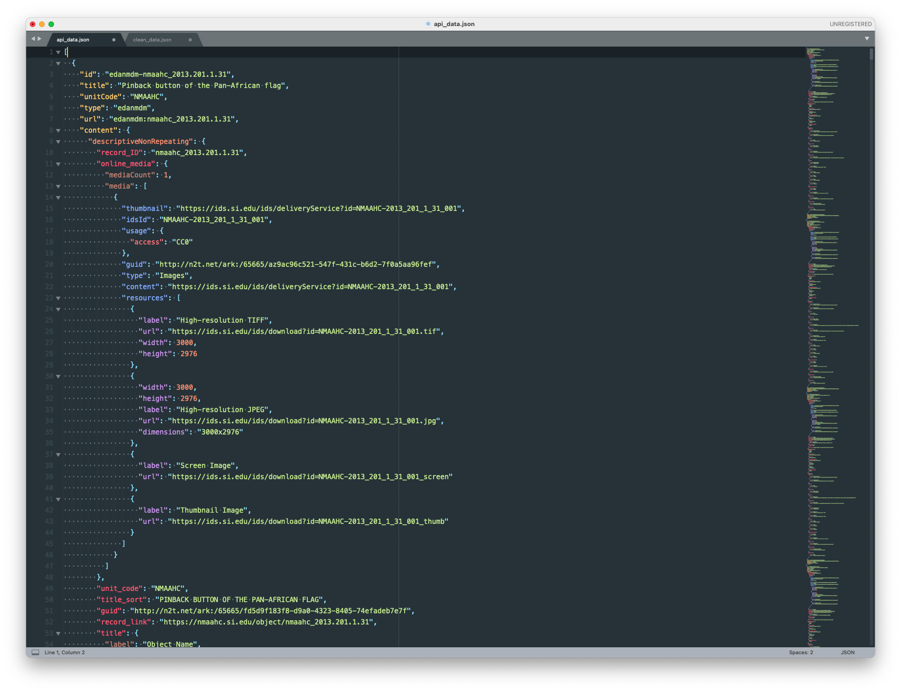
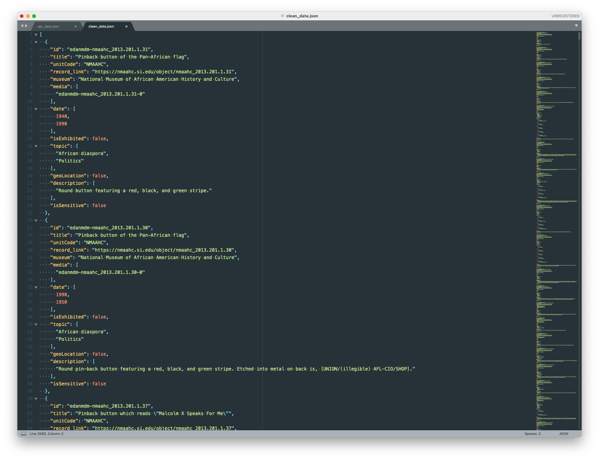
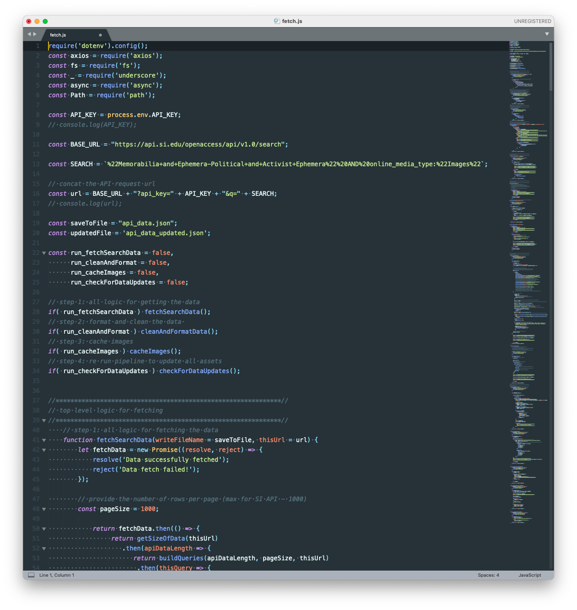

# What We Fought and Fight for: The History of Activism 

#### Technologies used:
**Data Visualization**: d3.js, underscore.js, JavaScript<br>
**Front-end**: Vue, Vuetify<br>
**Data Cleaning and Processing**: Node.js, underscore.js
<br>

#### Project Links:
**Live Project**: [What We Fought and Fight for: The History of Activism](https://yoanacodes.github.io/projects/activism/) <br>
**Portfolio link with description**: [What We Fought and Fight for: The History of Activism](https://yoanacodes.github.io/activism) 

#### About:
We have seen an uptick in activism, spanning multiple movements such as race, immigration, women’s rights, lgbt rights, and general demand for equality across all populations. These fights are not new and it is fascinating to see how the artifacts and visuals associated with activism have evolved throughout time.

Partnering with the Smithsonian Institution (the world's largest museum, education, and research complex) during a joined collaboration with Parsons School of Design was a great opportunity to explore the question of activism in its historical context. The fact that the Smithsonian museums contain ephemera dating back to the 18th century speaks to the importance of these artifacts in preserving history and human’s plight for change. This project explores the topic of “Memorabilia and Ephemera – Political and Activist Ephemera” from the Smithsonian API and visualizes images that has a CC0 license.

It attempts to answer questions such as: What historic movements associated with activism have taken place throughout history? What ephemeral artifacts, such as posters and pamphlets, have we preserved in museums? How has the imagery evolved throughout time?

<br>

#### App Screenshot:





<br>

#### Data Assets Before and After Processing:

Raw Data from API:


Cleaned and Optimized Data:


<br>

#### Data Cleaning and Processing Pipeline Screenshot:



<br>

#### Project build in Vue

```
cd app
npm install
```

##### Compiles and hot-reloads for development
```
npm run serve
```

##### Compiles and minifies for production
```
npm run build
```