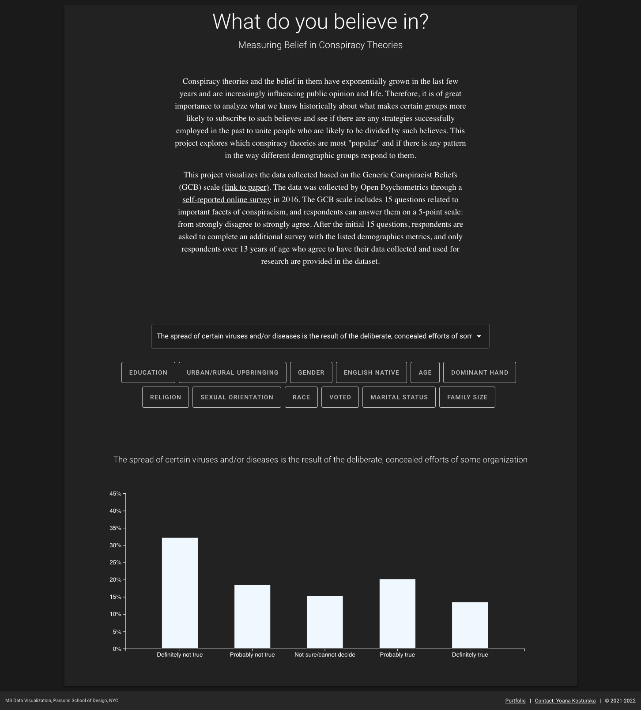
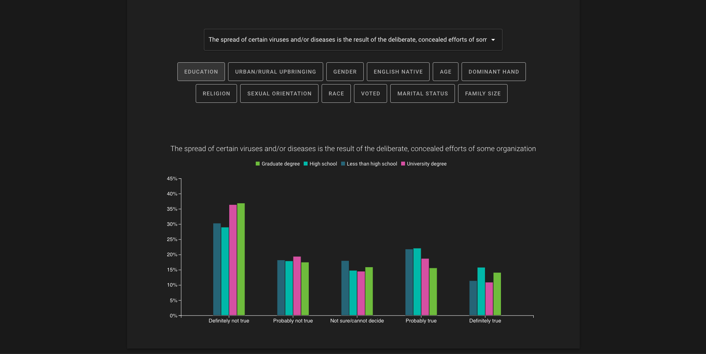

# What do you believe in: Measuring Belief in Conspiracy Theories

<br>

#### Technologies used:
**Data Visualization**: d3.js, underscore.js, JavaScript<br>
**Front-end**: Vue, Vuetify, Vuex<br>


#### Project Links:
**Live Project**: [What do you believe in?](https://yoanacodes.github.io/projects/belief_in_conspiracy_theories/) <br>
**Portfolio link with description**: [What do you believe in?](https://yoanacodes.github.io/#/projects/conspiracies) 

#### About:
Conspiracy theories and the belief in them have exponentially grown in the last few years and are increasingly influencing public opinion and life. Therefore, it is of great importance to analyze what we know historically about what makes certain groups more likely to subscribe to such believes and see if there are any strategies successfully employed in the past to unite people who are likely to be divided by such believes. This project explores which conspiracy theories are most "popular" and if there is any pattern in the way different demographic groups respond to them.

This project visualizes the data collected based on the Generic Conspiracist Beliefs (GCB) scale (link to paper). The data was collected by Open Psychometrics through a self-reported online survey in 2016. The GCB scale includes 15 questions related to important facets of conspiracism, and respondents can answer them on a 5-point scale: from strongly disagree to strongly agree. After the initial 15 questions, respondents are asked to complete an additional survey with the listed demographics metrics, and only respondents over 13 years of age who agree to have their data collected and used for research are provided in the dataset.

<br>

#### App Screenshot:




<br>

#### Project build in Vue
```
cd app
npm install
```

##### Compiles and hot-reloads for development
```
npm run serve
```

##### Compiles and minifies for production
```
npm run build
```