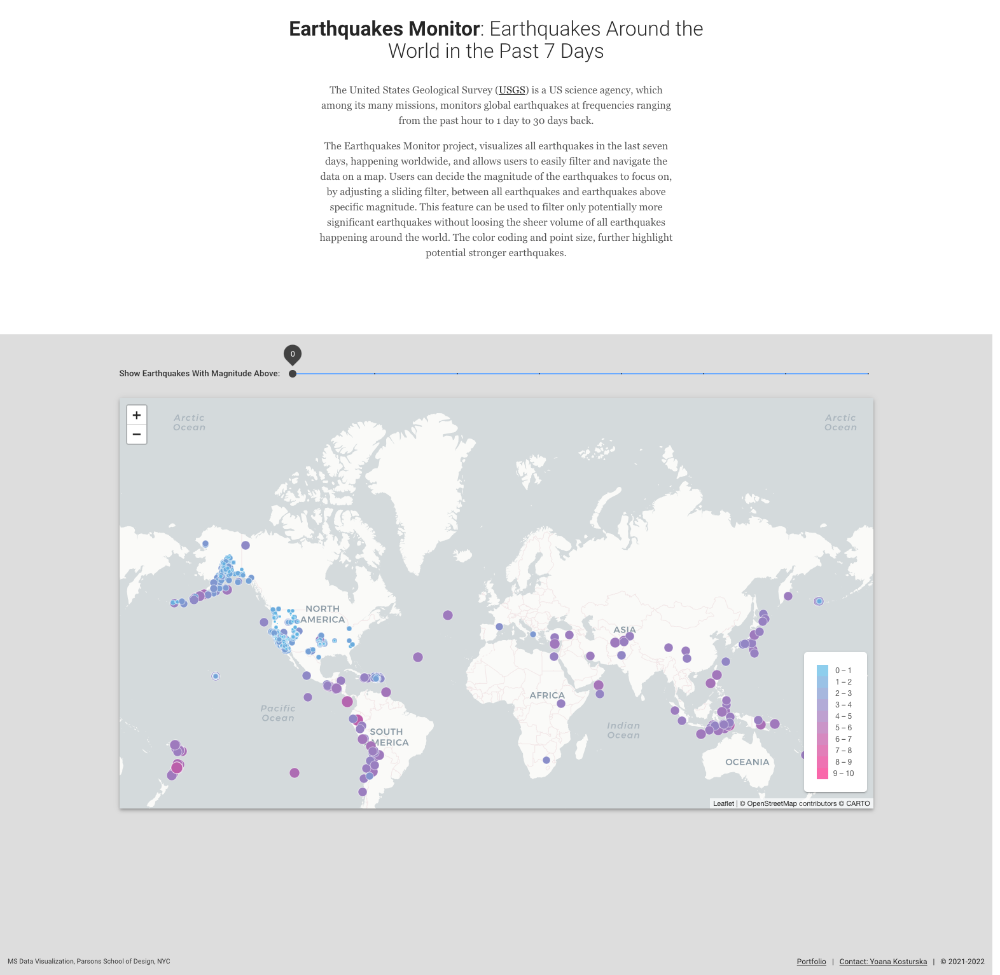
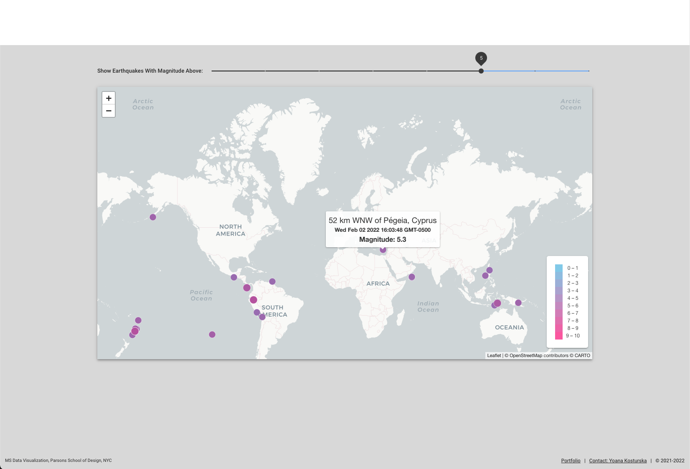
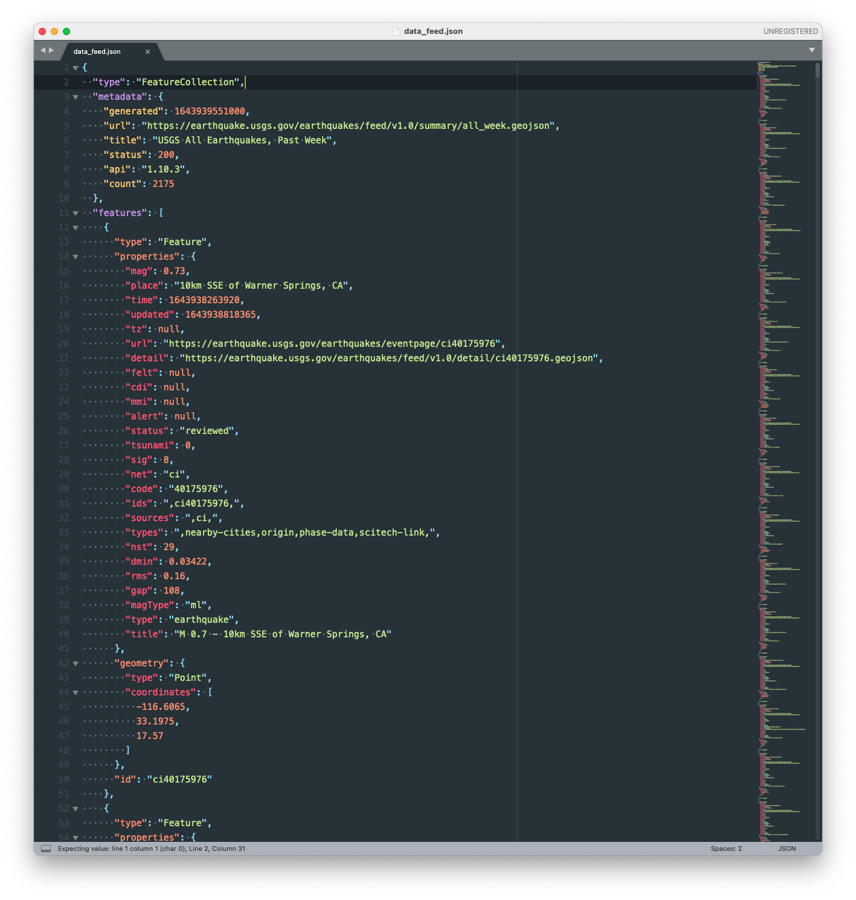

# Earthquakes Monitor

#### Technologies used:
**Data Visualization**: Leaflet, JavaScript<br>
**Front-end**: Vue, Vuetify, Vuex

<br>
#### Project Links:
**Live Project**: [Earthquakes Monitor](http://) <br>
**Portfolio link with description**: [Earthquakes Monitor](http://) 

#### About:
The United States Geological Survey [(USGS)](https://earthquake.usgs.gov/earthquakes/feed/v1.0/csv.php) is a US science agency, which among its many missions, monitors global earthquakes at frequencies ranging from the past hour to 1 day to 30 days back.

The Earthquakes Monitor project, visualizes all earthquakes in the last seven days, happening worldwide, and allows users to easily filter and navigate the data on a map. Users can decide the magnitude of the earthquakes to focus on, by adjusting a sliding filter, between all earthquakes and earthquakes above specific magnitude. This feature can be used to filter only potentially more significant earthquakes without loosing the sheer volume of all earthquakes happening around the world. The color coding and point size, further highlight potential stronger earthquakes.

<br>
#### App Screenshot:




<br>
#### Data Feed Screenshot:




<br>
<br>
#### Project build in Vue
```
npm install
```

##### Compiles and hot-reloads for development
```
npm run serve
```

##### Compiles and minifies for production
```
npm run build
```