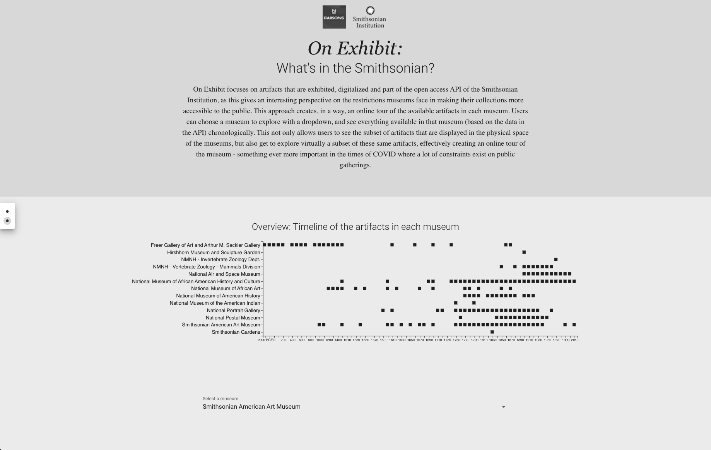
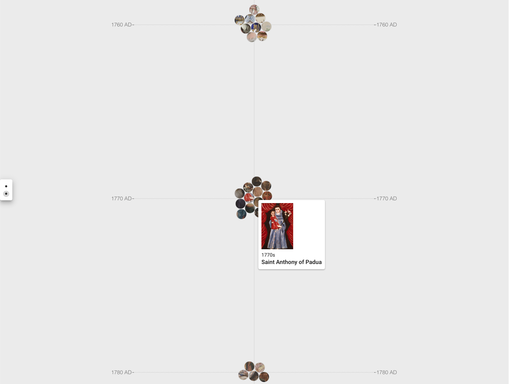
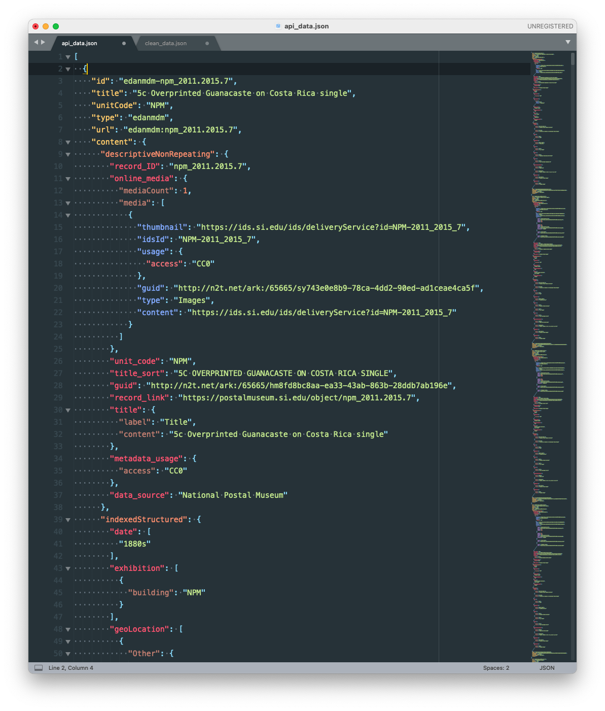
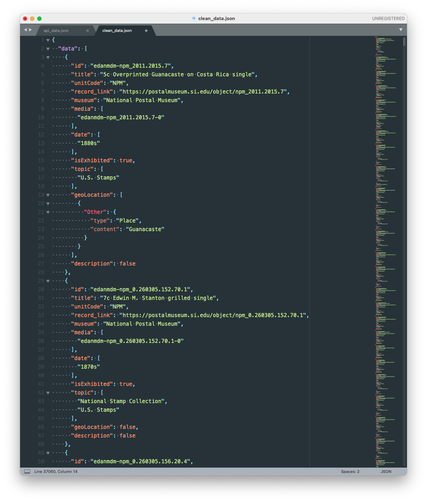
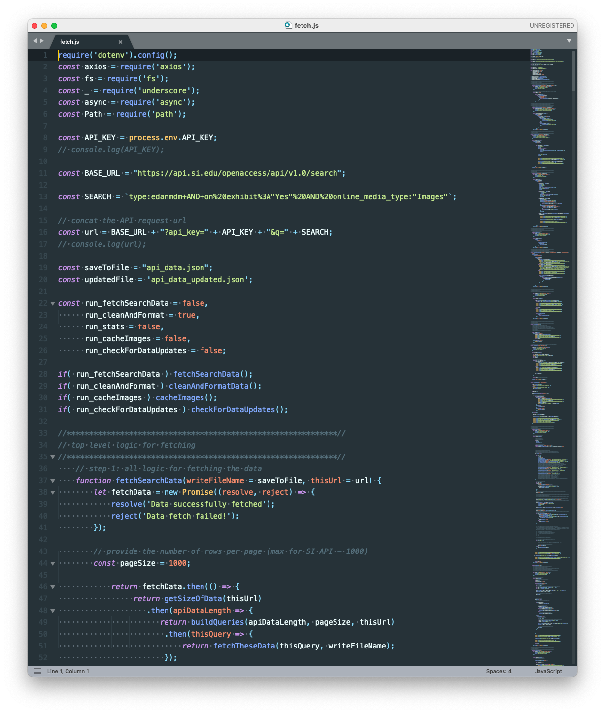

# On Exhibit: What's in the Smithsonian?

#### Technologies used:
**Data Visualization**: d3.js, underscore.js, JavaScript<br>
**Front-end**: Vue, Vuetify, Vuex<br>
**Data Cleaning and Processing**: Node.js, underscore.js
<br>
<br>
#### Project Links:
**Live Project**: [On Exhibit: What's in the Smithsonian?](http://) <br>
**Portfolio link with description**: [On Exhibit: What's in the Smithsonian?](http://) 

#### About:
On Exhibit focuses on artifacts that are exhibited, digitalized and part of the open access API of the Smithsonian Institution, as this gives an interesting perspective on the restrictions museums face in making their collections more accessible to the public. This approach creates, in a way, an online tour of the available artifacts in each museum. Users can choose a museum to explore with a dropdown, and see everything available in that museum (based on the data in the API) chronologically. This not only allows users to see the subset of artifacts that are displayed in the physical space of the museums, but also get to explore virtually a subset of these same artifacts, effectively creating an online tour of the museum - something ever more important in the times of COVID where a lot of constraints exist on public gatherings.

<br>

#### App Screenshot:






<br>
#### Data Assets Before and After Processing:
Raw Data from API:

Cleaned and Optimized Data:

<br>
#### Data Cleaning and Processing Pipeline Screenshot:



<br>
<br>
#### Project build in Vue
```
npm install
```

##### Compiles and hot-reloads for development
```
npm run serve
```

##### Compiles and minifies for production
```
npm run build
```