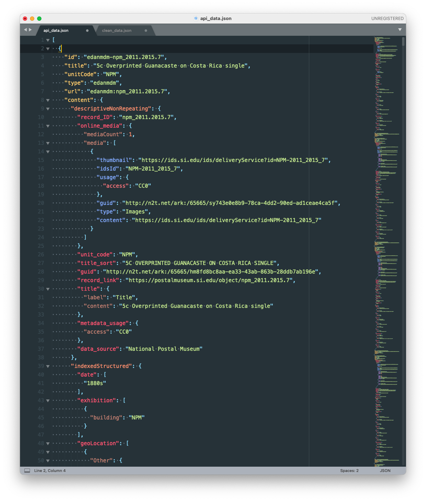

# On Exhibit: What's in the Smithsonian?

#### Technologies used:
**Data Cleaning and Processing**: Node.js, underscore.js
 
 

#### Project Links:
**Live Project**: [On Exhibit: What's in the Smithsonian?](https://yoanacodes.github.io/projects/on_exhibit/)  
**Portfolio link with description**: [On Exhibit: What's in the Smithsonian?](https://yoanacodes.github.io/#/projects/onexhibit) 

 

#### App Screenshot:

 

#### Data Assets Before and After Processing:

Raw Data from API:

Cleaned and Optimized Data:

 

#### Data Cleaning and Processing Pipeline Screenshot:

