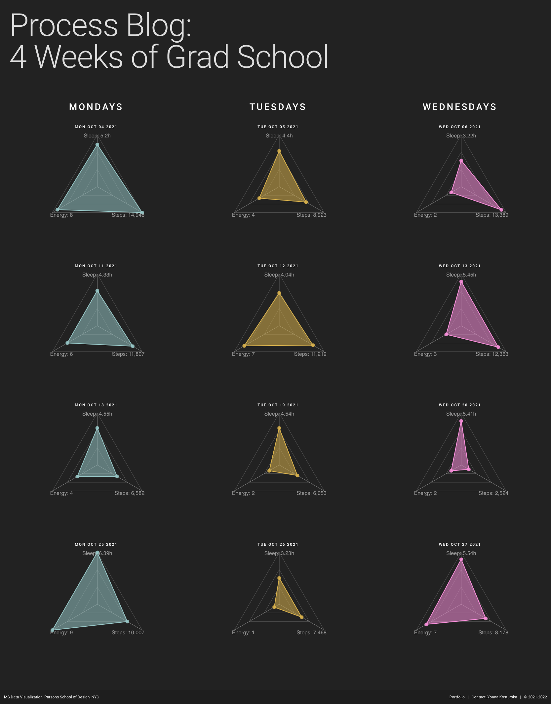
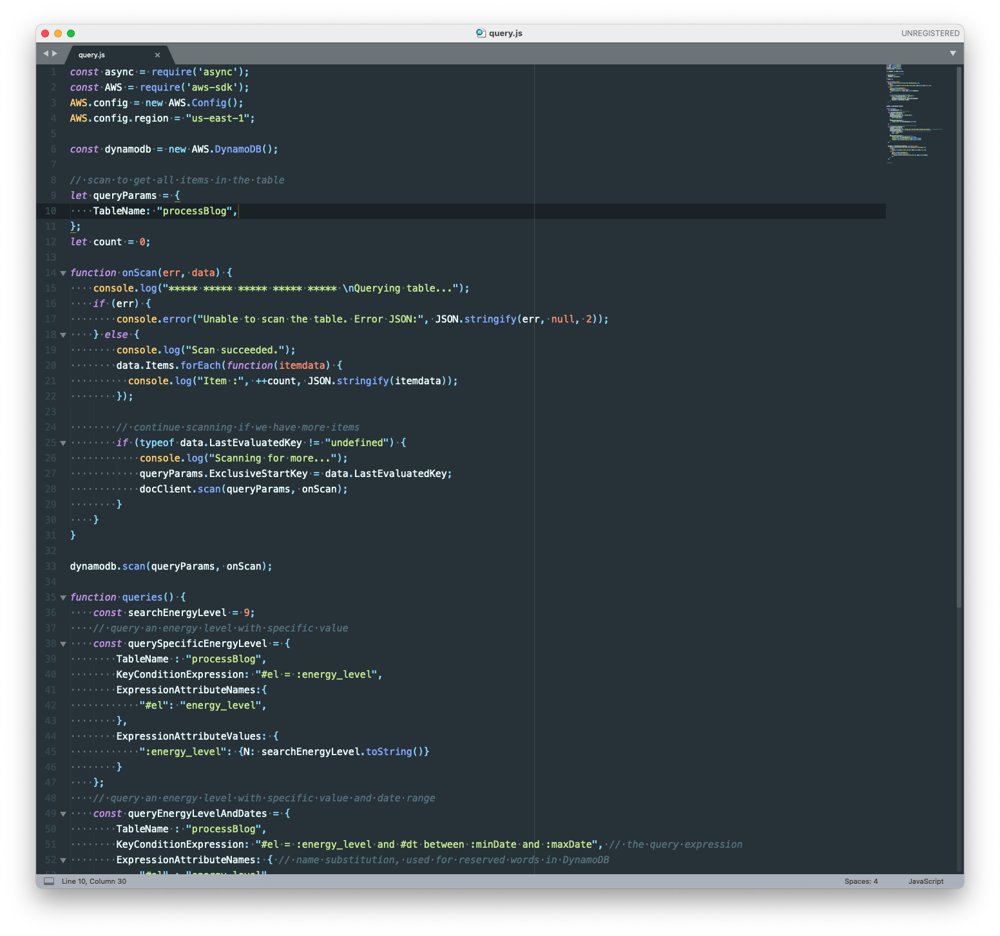

## Process Blog: 4 Weeks of Grad School

#### Technologies Used:
**Data Visualization**: d3.js (radar-chart-d3), underscore.js, JavaScript<br>
**Front-end**: Vue, Vuetify, Vuex<br>
**Backend**: Node.js, Express, DynamoDb, AWS

<br>

#### Project Links:
**Live Project**: [Process Blog](https://yoanacodes.github.io/projects/visualizing_gradschool/) <br>
**Portfolio link with description**: [Process Blog](https://yoanacodes.com/#/projects/visualizinggradschool) 

#### About:
This project is mainly about experimenting with DynamoDb as a database and getting to know AWS. It was part of a class on Data Structures I took in the MS Data Visualization program at Parsons School of Design. 

This project visualizes four weeks of my life in grad school – measuring sleep, energy levels and steps taken during each Monday, Tuesday, and Wednesday (the days I had the most classes). It was interesting to reflect on my life in a visual form and observe the patterns. 

<br>

#### App Screenshot:


<br>

#### DynamoDB Queries Screenshot:



<br>
<br>

#### Project build in Vue
```
cd app
npm install
```

##### Compiles and hot-reloads for development
```
npm run serve
```

##### Compiles and minifies for production
```
npm run build
```